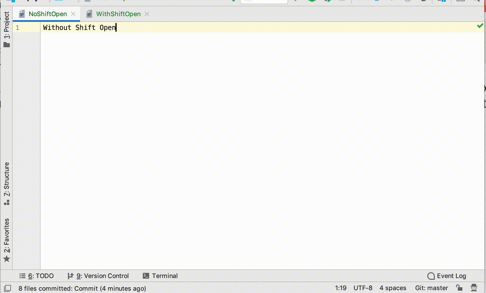

# Shift Open

IntelliJ platform plugin that just allows you to hide/open a tool window without 
moving the focus to that panel.

To make it work you need to use `ctrl-shift-number` instead of your regular `ctrl-number` shortcut.
So, if you use `ctrl-9` to open Version Control Panel, you can use `ctrl-shift-9`
to open this panel without focus transferring.

